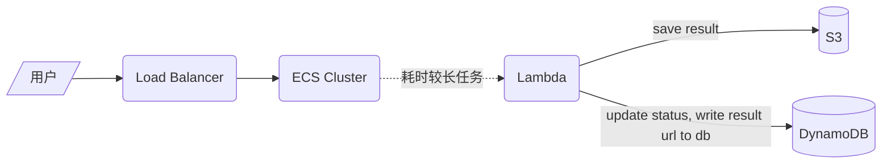
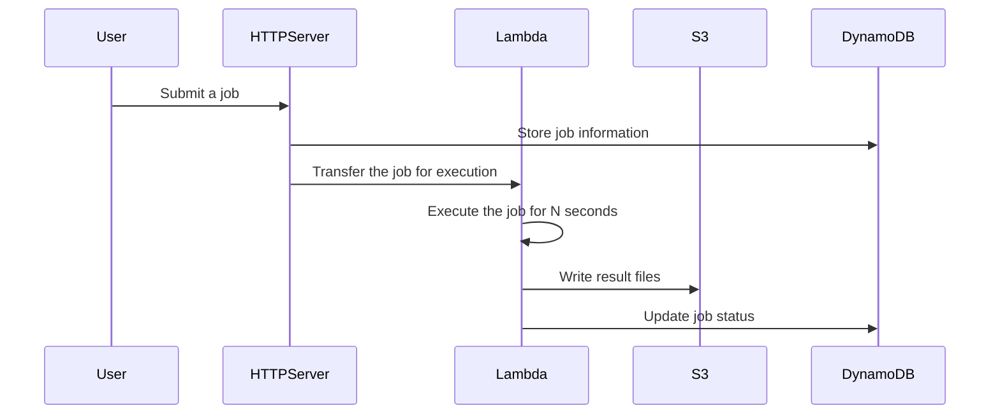

# Architecture diagram

# time sequence diagram 

# 改进

- lambda 最多执行15分钟，这是aws 的限制， 如果渲染时间很长， 不建议使用
- 把 yaml 拆分成多个 小的 yaml 模板，然后用 aws sam 打包 。 
- 可以考虑用 aws step function
- 可以考虑 分别 CI/CD : lambda 和 主程序
- 考虑使用 UpdatePolicy ,DeletionPolicy 