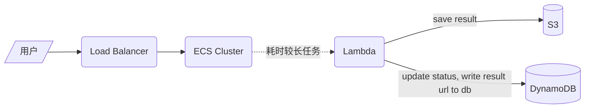
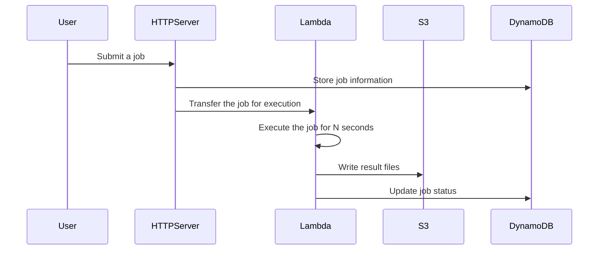

# Architecture diagram

# time sequence diagram 

# 部署

cd cloudformation 

先运行  ./github_role.sh  创建和 github CI/CD 相关的内容。  此时， ecr 里是没有docker image 的，程序肯定跑不起来
要手工 push 个 image 到 ecr 里， 下面的步骤才能部署成功。 

然后 运行 ./ecs.sh deploy | destroy  

# 简单测试

部署成功以后， 去 load balancer 里看下 当前的 load balance Dns cname 是多少 , 设置到下面的 TEST_URL

设置 bash 环境变量
export TEST_DYNAMO_TABLE="TestJobs"
export TEST_URL="sankred9527-dev-api-1255219210.ap-northeast-1.elb.amazonaws.com"

然后运行 
./tools/c.py --add 添加1个 job

./tools/c.py --addmany 添加 N 个 job， 可以自己调参数

./tools/c.py --query [job uuid] 查询 job 状态 

c.py 里有 jwt 支持

# 改进

- lambda 最多执行15分钟，这是aws 的限制， 如果渲染时间很长， 不建议使用
- 把 yaml 拆分成多个 小的 yaml 模板，然后用 aws sam 打包 。 
- 可以考虑用 aws step function
- 可以考虑 分别 CI/CD : lambda 和 主程序
- 考虑使用 UpdatePolicy ,DeletionPolicy 